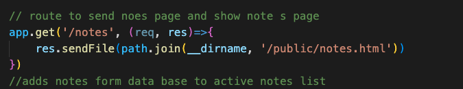
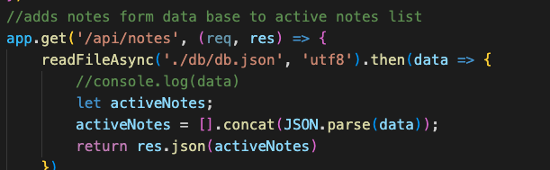
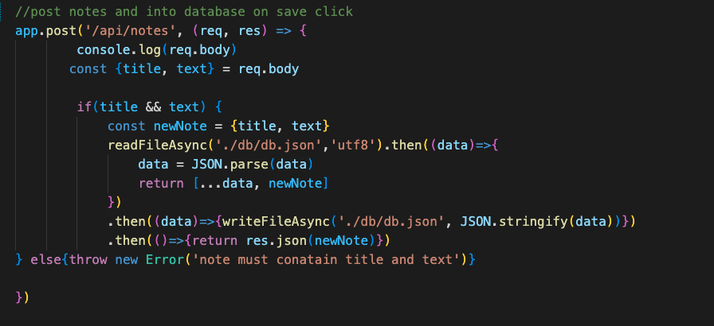
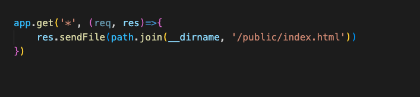

## Table of Contents
  * [License](#License)
  * [Title](#Title)
  * [Description](#Description)
  * [Installation](#Installation)
  * [Usage](#Usage)
  * [Contribution](#Contribution)
  * [Test](#Test)
  * [Technologies](#Technologies)
  * [Questions](#Questions)
  * [Spot-light](#Spot-light)
  
  ## License
  
  

  # Note Taker 
  ### Grant Ellington
  ## Description
  This is part of the completion of classwork for the Vanderbilt bootcamp. In it hey gave me the starter code without the routes and had students complete the routes for get and post. For further work a delete route can be added.
  
  ## Installation
  
  Follow the heroku link to open in your browser

  [heroku-link]( https://obscure-everglades-30566.herokuapp.com/)
  
  ## Usage Information
  
  To use, use the heroku link under installation.
  
  ## Contribution 
  
  Contact the creator listed in Questions.
  
  ## Test
  
  N/A
  
  
  ## Technologies
  Project is created with:
  * javascript
  * express
  * html
  
  
  ## Questions
  Grant-Ellington
  [gellingtonem6@gmail.com](gellingtonem6@gmail.com)

  ## Spot-light
  The below route takes you to the starting page.

  
  
  The below route takes show active notes to the left.

  

  The below route saves notes to the database.

  

  The below route is a wild card route that will take you to the main page when an invalid or no route is given.
  
   
